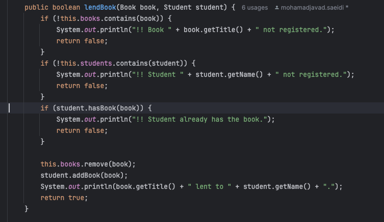

# se-lab-exp-3

# اجرای تست‌ها با نمایش درصد پوشش (code coverage)
تصاویر اجرای مراحل طبق دستور در بخش زیر به ترتیب آمده است.

# استفاده از TDD:

## بخش اول:

در این بخش ابتدا به یافتن **۲ ایراد** مربوط به می‌پردازیم.

1. ایراد اول این هست که در تابع lendBook چک نمی‌کند که کاربر آیا وجود دارد یا نه و اگر دانش‌اموز ثبت‌نام نکرده‌ای بخواهد کتاب ثبت شده‌ای را بگیرد می‌تواند غلط است و باید چک شود که آیا دانش‌آموز قبلا ثبتنام کرده‌است یا نه.
2. ایراد دوم نیز این هست که در تابع returnBook بعد از چک کردن اینکه این دانش‌آموز کتاب را قبلا قرض گرفته یا نه این کتاب را از لیست کتاب‌های آن دانش‌آموز حذف نمی‌کنیم و یک دانش‌آموز می‌تواند یک کتاب را چندبار پس دهد که خطا است. 

در ادامه ۲ تست برای شناسایی و این مشکلات می‌نویسیم.

1. در تست checkStudentRegistered که در کلاس LibraryTests آن را مشاهده‌ می‌کنید چک می‌کنیم که وقتی دانش‌آموزی ثبتنام نکرده باشد نباید بتواند کتابی را به امانت بگیرد.
که در ابتدا مشاهده می‌کنیم این تست ناموفق شد.

سپس در ادامه کد تابع lendBook را به شکل زیر تغییر دادیم:

و وقتی دوباره تست را اجرا کردیم تست با موفقیت پاس شد و خطای مربوطه را نمایش داد:

2. برای مشکل دوم ابتدا تست می‌نویسیم که در این تست یک کاربر تلاش کند یک کتاب را دوبار برگرداند و باید دفعه دوم خطا دریافت کند.
در ابتدا مشاهده می‌کنیم که تست ناموفق می‌شود و دانش‌آموز توانسته است دوبار کتاب را برگرداند.

سپس کد مربوط به تابع برگرداندن کتاب را اصلاح می‌کنیم که در شکل زیر اصلاح شده آن‌را مشاهده‌می‌کنید:

و بعد از آن وقتی تست را اجرا کنیم با موفقیت پاس می‌شود و یک کاربر نمی‌تواند دوبار یک کتاب را برگرداند.:

## بخش دوم:
برای این بخش کافی است که بر اساس توضیحات javadoc به نوشتن تست بپردازیم. بر اساس توضیحات javadoc نوشته شده بالای متد searchStudents، باید تست را به گونه‌ای بنویسیم که برای SearchTypeهای Author و Title جواب متد null شود. پس ابتدا تعدادی student اضافه می‌کنیم و حالت‌های مختلف SearchType را در تست می‌اوریم.
متن تست در کد قابل مشاهده است.
نتیجه‌ی تست زمانی که هنوز پیاده‌سازی برای متد searchStudents وجود ندارد.

سپس کد مربوطه را به صورت زیر پیاده‌سازی می‌کنیم:

و بعد از آن وقتی تست را اجرا کنیم با موفقیت پاس می‌شود و برای SearchTypeهای غیر از ID و NAME مقدار null برمی‌گرداند.

به همین منوال برای متد searchBooks ادامه می‌دهیم. براساس توضیحات javadoc، تنها حالتی از جست‌جو که معتبر نیست، جست‌و‌جو با اسم است. پس تست را به گونه‌ای می‌نویسیم که در حالت جست‌و‌جو با اسم، مقدار null برگرداند. کد تست در کدبیس موجود است.
حال تست را قبل از پیاده‌سازی اجرا می‌کنیم. نتیجه‌ی تست به صورت زیر است:

سپس کد مربوطه را به صورت زیر پیاده‌سازی می‌کنیم:

و بعد از آن وقتی تست را اجرا کنیم با موفقیت پاس می‌شود و برای SearchType با مقدار NAME مقدار null برمی‌گرداند.

# پرسش‌ها

## ۱. مقایسه TDD و تست سنتی

TDD:
روش: ابتدا تست‌ها نوشته می‌شوند و سپس کد به گونه‌ای توسعه داده می‌شود که این تست‌ها پاس شوند.

مزایا:
1. بهبود کیفیت کد با ایجاد طراحی بهتر و مستندسازی ضمنی.
2. کاهش بروز باگ‌ها به دلیل تست‌های مداوم.
3. بازخورد سریع درباره صحت عملکرد کد.

معایب:
1. نیاز به زمان و تمرین برای تسلط.
2. ممکن است برای پروژه‌های کوچکتر یا سریع‌التوسعه بهینه نباشد.

پروژه‌های مناسب:

1. پروژه‌های بزرگ و پیچیده با نیاز به پایداری و کیفیت بالا.
2. پروژه‌هایی که نیاز به تغییرات مکرر دارند.

تست سنتی:

روش: ابتدا کد نوشته می‌شود و سپس تست‌ها برای بررسی صحت کد نوشته می‌شوند.

مزایا:

1. ساده‌تر و سریع‌تر برای شروع.
2. نیاز به کمترین تغییر در فرایند توسعه.

معایب:

1. امکان بروز باگ‌های بیشتر به دلیل نبود تست‌های مداوم.
2. امکان نادیده گرفتن برخی از مشکلات و باگ‌های پیچیده.

پروژه‌های مناسب:

1. پروژه‌های کوچکتر یا با زمان محدود.
2. پروژه‌هایی که نیاز به تغییرات کمتری دارند.

## ۲. نقش تیم‌های توسعه و تضمین کیفیت در تست نرم‌افزار

### تیم توسعه:

تست‌های اصلی:

Unit Tests: تست‌هایی که برای بررسی واحد‌های کوچک کد مانند توابع و متدها استفاده می‌شوند.

Integration Tests: تست‌هایی که تعامل بین ماژول‌ها و کامپوننت‌های مختلف نرم‌افزار را بررسی می‌کنند.

چرا؟:

توسعه‌دهندگان عمیق‌ترین دانش از ساختار داخلی و جزئیات کد را دارند و می‌توانند تست‌های دقیق و کاربردی ایجاد کنند.

### تیم QA:

تست‌های اصلی:

System Tests: تست‌هایی که عملکرد کل سیستم را به عنوان یک کل بررسی می‌کنند.

Acceptance Tests: تست‌هایی که بر اساس نیازمندی‌های مشتری و شرایط پذیرش تعریف شده‌اند.

Performance Tests: تست‌هایی که عملکرد و مقیاس‌پذیری سیستم را ارزیابی می‌کنند.

چرا؟:

تیم QA دید کلی‌تری از کاربرد نرم‌افزار دارد و می‌تواند تست‌های کاملی را بر اساس نیازمندی‌های کاربران و شرایط عملیاتی انجام دهد.

## ۲. اجرای پروژه فعلی با درصد پوشش تست

مشابه کاری که در ابتدای این فایل شرح داده شد انجام شد و تصویر نمونه‌ی آن در بخش زیر آمده است. تصاویر کامل‌تر در ابتدای توضیحات قرار داده شده است.

